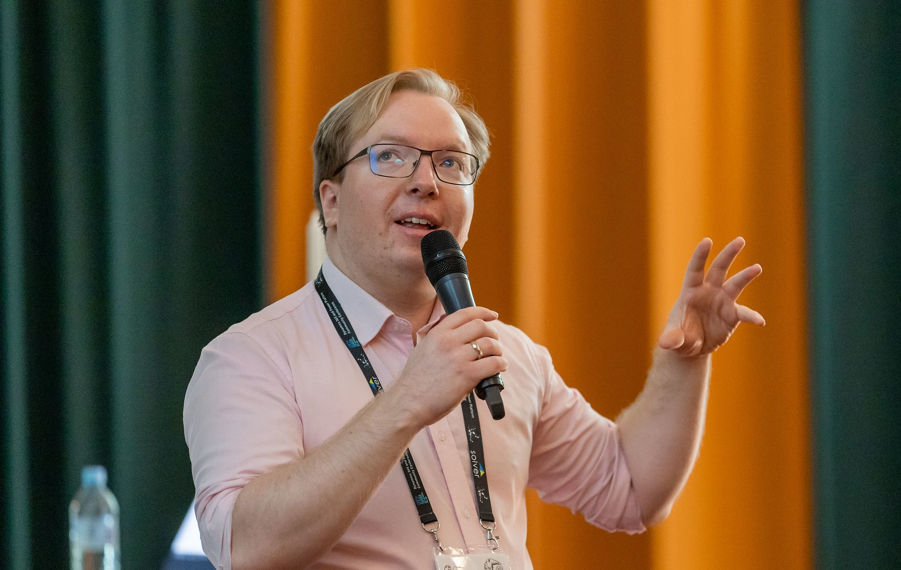

I am Magnus Gether Sørensen. I prefer to talk tech and ideas instead of events and people. However, I recognize the need to provide some credibility to this site. This page highlights some of the work I have done with Dataverse. This will hopefully give credibility to my motivations - I want to push the boundaries of knowledge.

As a developer, I attempt to use well-typed development whenever possible. This makes it harder for me to do things incorrectly. If I can deliver value while being extremely fatigued, I know I can delivery even more value when I am refreshed. There is no reason to waste mental capacity on things that can be solved with types.

## Pushing boundaries
My work with the platform began in 2016 when I was in university. I developed the [View Extender](https://github.com/delegateas/Daxif/wiki/ViewExtender) during my first two weeks as a consultant. The next year or so I developed the first version of [XrmMockup](https://github.com/delegateas/XrmMockup).

The last years of my time as a student was spent on customer projects and maintaining several of the tools from Delegate.
* [XrmDefinitelyTyped](https://github.com/delegateas/XrmDefinitelyTyped)
* [DAXIF](https://github.com/delegateas/Daxif)
* [XrmContext](https://github.com/delegateas/XrmContext)
* [XrmFramework](https://github.com/delegateas/XrmFramework)
* [DeprecationTool](https://github.com/delegateas/DeprecationTool)

My time as a student ended with my master thesis, [Analysis of a workflow language](https://findit.dtu.dk/en/catalog/5d6e4a63d9001d66e80217b3). Here I created my own programming language to mimic the style of the plugin execution pipeline in Dataverse. This allowed me to develop methods for doing program analysis and security analysis on that language.

The remainder of my time has been spent on countless of customer projects. All of them had complex business needs, that required bending the platform and learning its inner workings.

I have been an MVP since 2023, only further helping me pushing the boundaries of the platform.

